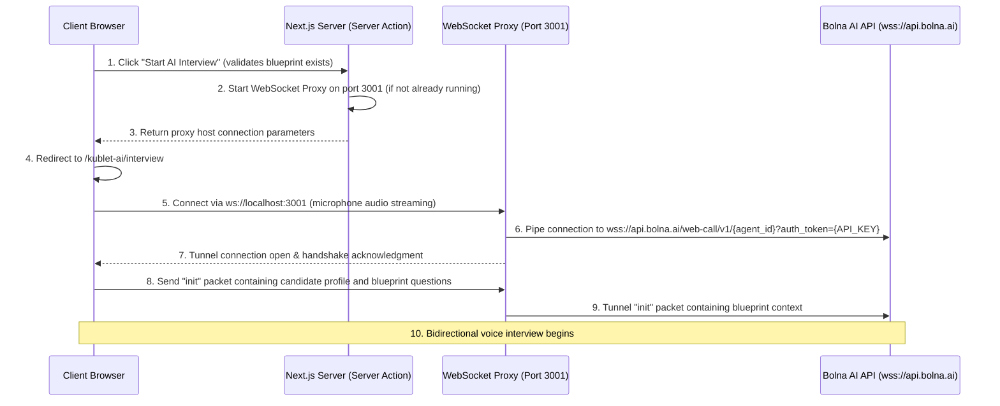

# Implementation Plan - Feature 6: Bolna Voice Interview Integration

Integrate the Bolna Voice Interview capability into the Kublet AI section. This enables candidates to launch real-time browser-based voice interviews based on their generated candidate profile and interview blueprint.

---

## Architecture & API Flow Overview

To securely connect the client browser to the Bolna Voice AI agent without exposing the secret `BOLNA_API_KEY`, we will implement a backend WebSocket Proxy. 

### Connection Topology



### 1. Context Passing Protocol
The generated interview blueprint questions and candidate profile will be formatted and passed inside the `meta_data.context_data` block during the initial WebSocket handshake message:
```json
{
  "type": "init",
  "meta_data": {
    "context_data": {
      "candidate_name": "Candidate Name",
      "candidate_level": "Senior",
      "target_role": "Full Stack Engineer",
      "intro_questions": "Question 1, Question 2...",
      "project_questions": "Question 1, Question 2...",
      "technical_questions": "Question 1, Question 2...",
      "behavioral_questions": "Question 1, Question 2..."
    }
  }
}
```

---

## Proposed Changes

We will create and modify the following files:

### Backend Actions & Scripts

#### [NEW] [bolna.js](file:///e:/Products/Kublet/actions/bolna.js)
A new server action file containing:
- `startBolnaSession(profile, blueprint)`:
  - Validates that the blueprint and candidate profile are present.
  - Spawns the WebSocket proxy background process (if not running).
  - Prepares context data.
  - Returns connection parameters (`agentId`, `websocketHost: "ws://localhost:3001"`, `contextData`).

#### [NEW] [websocket-proxy.js](file:///e:/Products/Kublet/scripts/websocket-proxy.js)
A standalone WebSocket proxy script that runs on `localhost:3001` (using the pre-installed `ws` library):
- Connects securely to Bolna's server:
  `wss://api.bolna.ai/web-call/v1/${agentId}?auth_token=${BOLNA_API_KEY}&user_agent=web-call&enforce_streaming=true`
- Tunnels incoming audio and control data from the browser to Bolna, and proxies response audio packets back to the browser.
- Automatically handles reconnection and connection teardowns.

### Frontend Components & Pages

#### [MODIFY] [ResumeUpload.jsx](file:///e:/Products/Kublet/app/(main)/kublet-ai/_components/ResumeUpload.jsx)
- Below the **Interview Blueprint** section, render a premium gold-styled **"Start AI Interview"** button.
- When clicked, invoke `startBolnaSession(profile, blueprint)` to start the proxy, store connection config in a temporary state/localStorage, and redirect the user to `/kublet-ai/interview`.

#### [NEW] [page.jsx](file:///e:/Products/Kublet/app/(main)/kublet-ai/interview/page.jsx)
A new page located at `/kublet-ai/interview` which will:
- Display interview parameters, such as:
  - **Interview Status:** Ready / In Progress / Completed
  - **Agent Connection Status:** Disconnected / Connecting / Connected
  - **Microphone Status:** Permissions Granted / Muted / Active
  - **Current Interview Stage:** Intro / Project Deep-Dive / Technical / Behavioral
- Load `bolna-webcall-library.js` dynamically and initialize `BolnaWebCalling` using the local proxy address.
- Provide a clear **"End Interview"** button that stops the session and redirects the user back to the dashboard.

---

## User Review Required

> [!IMPORTANT]
> **API Key Protection**: This plan completely hides the `BOLNA_API_KEY` from the client by using a local WebSocket tunnel. The client only sees `ws://localhost:3001` and never obtains the API token.
>
> **Microphone Permissions**: Modern browsers require an explicit click action before activating the microphone and the `AudioContext` object. We will ensure the user must trigger a start button in the UI.

---

## Open Questions

> [!NOTE]
> No immediate open questions remain. The direct WebSocket connection to Bolna has been verified successfully from this server using the API key.

---

## Verification Plan

### Automated Tests
- Run `npm run build` to ensure there are no compilation or type-safety errors.

### Manual Verification
1. Upload a resume, run analysis, and generate a blueprint.
2. Click **Start AI Interview** and ensure it redirects to `/kublet-ai/interview`.
3. Check the page structure and verify it shows agent status, microphone permissions, and the active stage.
4. Verify microphone input successfully triggers audio packet streaming to the proxy.
5. Verify AI voice output plays back clearly and the interview concludes successfully when the **End Interview** button is clicked.
