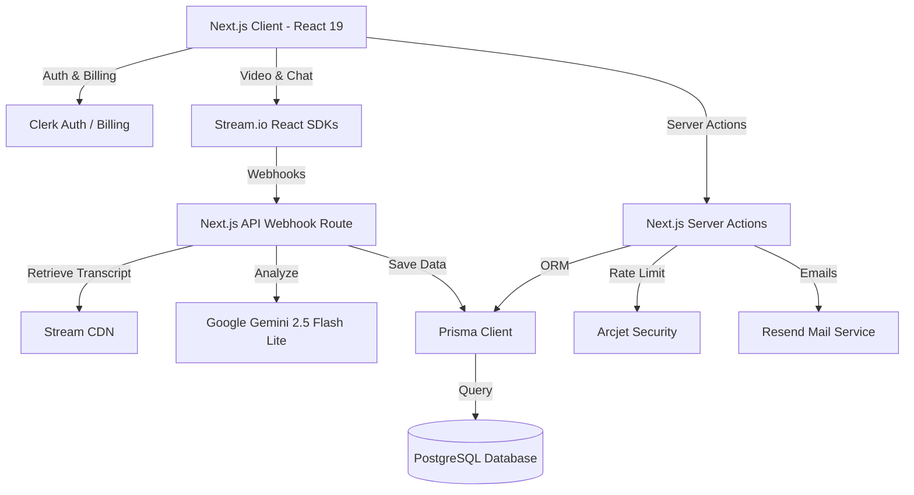

# Kublet: AI-Powered Mock Interview Platform - Interview Preparation Guide

This guide is structured to help you pitch the **Kublet** project in technical interviews and confidently handle deep-dive counter-questions from interviewers.

---

## 🌟 1. The 2-Minute Project Pitch (Elevator Pitch)

> "I built **Kublet**, a modern peer-to-peer mock interview platform that connects candidates with industry experts for live 1:1 prep sessions. The platform operates on a credit-based economy: candidates use credits to book mock interviews, and experts earn credits for conducting them, which they can later withdraw as cash payouts.
> 
> What makes Kublet unique is its **AI-driven co-pilot features**. During the interview, interviewers have access to an on-demand, role-specific **AI Question Generator** powered by Google Gemini. Post-interview, instead of generic comments, the platform automatically downloads the recorded call transcript from Stream.io, processes it, and uses Gemini to generate a highly detailed **AI Feedback Report** covering technical skills, communication, problem-solving, and actionable recommendations.
> 
> Structurally, it’s built on Next.js 16 (App Router), React 19, Tailwind CSS v4, and Prisma with PostgreSQL. I integrated **Clerk** for authentication, utilized **Clerk Billing** for credit tiers, used **Stream.io SDKs** for synchronized HD video calls and real-time chat, and secured all critical transaction/booking endpoints using **Arcjet** for rate-limiting and bot protection."

---

## 🛠️ 2. Core Tech Stack & System Architecture



### Key Technical Decisions:
*   **Next.js Server Actions**: Used for form submission, profile updating, and bookings to minimize client bundle size and build secure database transactions directly on the server.
*   **Database Schema**: Designed 6 PostgreSQL tables using Prisma: `User`, `Availability`, `Booking`, `Feedback`, `CreditTransaction`, and `Payout` with optimal relations and indexes.
*   **Stream.io integration**: Unified Video and Chat rooms utilizing the same JWT token client-side, eliminating duplicate token validation processes.
*   **Clerk Billing**: Adopted Clerk's experimental billing integration, avoiding Stripe checkout redirection boilerplate and maintaining plan configurations inside Clerk metadata.

---

## 🧑‍💻 3. Your Role & Core Contributions

In your interview, frame your role as a **Full-Stack Developer / Technical Architect** who owned the end-to-end flow:
1.  **Database & Transactions Design**: Created the database schema and booking logic. Implemented strict concurrency controls to prevent double-booking.
2.  **Video Conferencing & Real-Time Sync**: Integrated Stream.io's video-react-sdk and chat-react-sdk. Designed a clean, distraction-free split screen call layout (Video on left, Chat & AI Questions Panel on right).
3.  **Real-Time Webhook Pipeline**: Authored the Next.js API route that listens to Stream.io webhooks. Created a parser to read Stream’s JSONL transcript format and map speaker IDs to database usernames.
4.  **Generative AI Integration**: Engineered Gemini prompts to return strict JSON shapes, handling sanitization (e.g. stripping markdown block ticks) to prevent JSON parsing errors.
5.  **Security & Limits Enforcement**: Applied Arcjet rate limiters on critical actions (bookings, withdrawals) to prevent bot attacks and excessive API costs.

---

## ❓ 4. Tough Interview Counter-Questions & Answers

### Q1: In `bookSlot` (actions/booking.js), why did you wrap the database operations in a Prisma transaction (`db.$transaction`)? Why not write separate await statements?

**Answer:**
> "Using `db.$transaction` is critical here because booking a slot is a multi-step operation that must satisfy **ACID properties**, specifically atomicity. 
> 
> During a booking, three things must happen:
> 1. We create the `Booking` record.
> 2. We create a negative `CreditTransaction` to deduct credits from the interviewee.
> 3. We update the interviewee's `credits` balance and increment the interviewer's `creditBalance`.
> 
> If we ran these as separate sequential queries without a transaction, and the server crashed or the database connection dropped halfway through (e.g., after creating the booking but before deducting the credits), the database would enter an inconsistent state. The interviewee would get a free booking, or vice versa, credits could be deducted without a booking record. 
> 
> By wrapping them in a transaction, Prisma guarantees that either **all** of these database operations succeed, or they **all** roll back to the original state. It also prevents race conditions where an interviewee might try to double-spend their remaining credits by firing multiple booking requests in parallel."

---

### Q2: Let's talk about the Stream webhook in `app/api/webhooks/stream/route.js`. Webhook delivery is "at-least-once", meaning Stream might send duplicate events. How does your handler ensure it is idempotent?

**Answer:**
> "Webhooks are inherently unreliable and can duplicate. I designed the handler to be fully **idempotent** using a few key guards:
> 
> 1.  **Deduplication checks**: Before processing `call.transcription_ready`, we perform a query to see if a feedback record already exists for the corresponding `bookingId` (`booking.feedback`). If it does, we immediately log a skip message and return a `200 OK` response.
> 2.  **Safe database updates**: In the transaction where we save the feedback and complete the booking, we use Prisma's `upsert` on the `Feedback` model instead of `create`. Since `bookingId` is a unique field in the `Feedback` table, an `upsert` guarantees that even if concurrent write requests bypass the first read check, the database will safely overwrite or skip the write instead of failing with a unique constraint violation.
> 3.  **Credit check protection**: Before logging interviewer earnings, we search the `CreditTransaction` table for a transaction of type `BOOKING_EARNING` linked to that `bookingId`. We only create the earning transaction if none exists, ensuring the interviewer isn't paid twice for the same interview."

---

### Q3: Inside `CallRoom.jsx`, you use `useRef` for `clientRef` and `joinedRef`. What is their purpose, and why not just store them in standard React `useState`?

**Answer:**
> "I used `useRef` here for two major reasons: **avoiding infinite re-renders** and **handling React 18/19 Strict Mode's double-mount behavior**.
> 
> 1.  **Strict Mode Guard (`joinedRef`)**: In development, React mounts, unmounts, and remounts components to detect side-effect clean-up bugs. If we don't guard the Stream client initialization, it will trigger the `.join()` call twice in rapid succession. The second join call will fail because the user is already connecting. By setting `joinedRef.current = true` immediately, we block the second execution.
> 2.  **Preventing Re-renders (`clientRef`)**: The `StreamVideoClient` instance is a heavy class-based SDK instance. If we store it in a React `useState`, any minor mutation or state check might trigger component re-renders. More importantly, when the component unmounts, we need to call `client.disconnectUser()`. If we put the client in a state variable, we would have to add it as a dependency in the `useEffect` cleanup. This would cause the effect to clean up and re-initialize the connection on every state update. Using a ref lets us store the active instance across renders and safely access it in the cleanup return function without triggering dependency loops."

---

### Q4: I notice in `lib/checkUser.js` that you call `checkUser()` on every render of the `Header` component. Isn't this highly inefficient to run a database query and call Clerk on every page view?

**Answer:**
> "It looks like an expensive operation at first glance, but it's highly optimized because of Next.js and Clerk's server caching:
> 
> 1.  **Server Component Execution**: `Header` is a Server Component, meaning this code runs on the server, minimizing round-trips from the client browser.
> 2.  **Clerk Session Cache**: Clerk's `currentUser()` is heavily cached on the server request level. It reads the JWT token from the headers, meaning it doesn't make a slow HTTP request to Clerk's servers on every single call.
> 3.  **Self-Healing Sync & Monthly Allocation**: This pattern acts as a self-healing sync. If a user changes their subscription plan on Clerk Billing, we need their credit balance in our database to reflect it. By running this check on the header, we automatically detect if their billing plan changed or if a new month has started. If so, we allocate their plan credits and update `creditsLastAlocatedAt`.
> 4.  **Database Optimization**: If the user is already synced and credits are up to date (which is 99% of requests), it's a single, highly indexed query on a unique field (`clerkUserId`), which executes in a few milliseconds in PostgreSQL. This gives us robust real-time billing updates without complex webhook latency."

---

### Q5: How does your AI pipeline handle transcript parsing and what happens if Gemini fails to return a valid JSON format?

**Answer:**
> "Stream.io transcriptions are delivered as raw `JSONL` files (JSON Lines). In our webhook handler:
> 1.  We download the file using Next.js `fetch`.
> 2.  We split the string by newlines and filter out empty lines.
> 3.  We parse each line as JSON, keeping only segments of type `'speech'`.
> 4.  We map the Stream `speaker_id` to the actual user names from our database using a speaker lookup map. This creates a human-readable transcript: `\"Name: Text\"` which is much easier for the LLM to understand.
> 
> For Gemini formatting, we tell the model in the prompt: *'Respond ONLY with a valid JSON object. No markdown, no backticks, no explanation.'* 
> However, LLMs can sometimes wrap their JSON in markdown code blocks like ` ```json ... ``` `. To handle this gracefully:
> *   We use a regular expression replacement: `raw.replace(/^```json|^```|```$/gm, "").trim()` to strip any markdown block wrappers before passing it to `JSON.parse()`.
> *   If `JSON.parse` still throws an error (e.g. if the JSON is malformed), we catch it in the outer block and return a `200 OK` response. This prevents Stream webhook from retrying endlessly while letting us log the error for diagnostic tracking. In a production setting, we could queue it to a dead-letter queue or retry with a lower temperature."

---

### Q6: Your platform supports credit payouts for interviewers. How did you design this process to prevent fraud or abuse?

**Answer:**
> "The withdrawal system is built around a secure **Two-Step Authorization Process** supported by rate limiting:
> 
> 1.  **Server-side Validation**: When an interviewer requests a payout, we check their `creditBalance` in the database to ensure they have enough credits.
> 2.  **Arcjet Rate Limiting**: We use an Arcjet token bucket rate limiter to prevent spamming the withdrawal API route.
> 3.  **Database Ledger Consistency**: We run the payout creation and credit deduction in a database transaction (`db.$transaction`). This instantly deducts their credits, preventing them from requesting multiple payouts before the first one is processed.
> 4.  **Admin Authorization**: Instead of automatically releasing funds, the transaction creates a `Payout` record with a status of `PROCESSING` and fires a secure email alert using **Resend** to our admin inbox (`realagnik.roni.2004@gmail.com`). The admin manually reviews the session recording and transcript to verify the interview actually took place, then releases the payout through our admin action. This acts as a circuit breaker against collusion or synthetic accounts."
